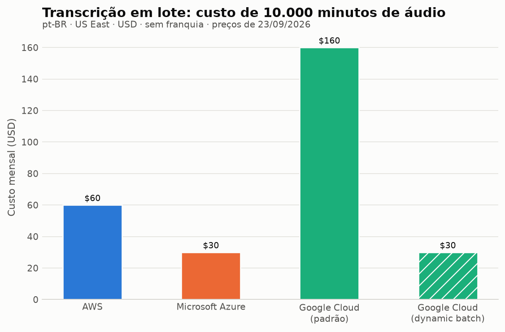

# Categoria 3 — Fala para texto: transcrição de áudio

- **Operação comparada:** transcrição assíncrona (em lote) do mesmo arquivo de áudio em português do Brasil
- **Modo de chamada:** assíncrono / lote — único modo oferecido pelos três para arquivos longos
- **Data da consulta às fontes:** 23/09/2026
- **Região de referência:** `us-east-1` (N. Virginia) na AWS e `East US` na Azure; no Google, **`us-central1` (Iowa)** — a tabela da Cloud Speech-to-Text V2 é regional e `us-central1` **não** é uma região US East. A diferença está declarada como limitação em vez de ser tratada como equivalência


## 1. Objetivo da categoria e caso de uso

Conversão de fala em texto transforma áudio gravado em transcrição pesquisável. O caso de uso típico é processar gravações de atendimento, reuniões ou conteúdo audiovisual para gerar legendas, permitir busca textual ou alimentar análises posteriores — inclusive análise de sentimento, o que liga esta categoria à primeira.

**Por que o modo em lote e não o tempo real:** transcrição em tempo real e em lote têm condições de uso, requisitos de formato e preços distintos. Comparar uma com a outra produziria números sem sentido. Os três provedores oferecem o modo em lote para arquivos armazenados, e é sobre ele que a comparação é feita.

## 2. Serviços comparados e operação equivalente

| Provedor | Serviço | Operação em lote | Operação em tempo real (fora da comparação) |
|---|---|---|---|
| AWS | Amazon Transcribe | `StartTranscriptionJob` | `StartStreamTranscription` |
| Microsoft Azure | Azure Speech in Foundry Tools | `Transcription_Create` (Speech to text REST API) | Reconhecimento em tempo real |
| Google Cloud | Cloud Speech-to-Text V2 | `BatchRecognize` | `StreamingRecognize`; `Recognize` para áudio < 60 s |

## 3. Comparação técnica

### 3.1 Entradas: formatos e origem do áudio

| Aspecto | Amazon Transcribe | Azure Speech (lote) | Cloud Speech-to-Text V2 |
|---|---|---|---|
| **Formatos em lote** | AMR, FLAC, M4A, MP3, MP4, Ogg, WebM, WAV | **WAV, MP3, OPUS/OGG, FLAC, WMA, AAC, ALAW em WAV, MULAW em WAV, AMR, WebM, SPEEX** | Formatos de áudio suportados pela API v2 |
| **Formatos recomendados** | FLAC ou WAV com PCM 16 bits | Formatos sem perda: WAV (PCM) e FLAC | — |
| **Origem do arquivo** | **Obrigatoriamente um bucket do Amazon S3** | URI público, URI com SAS, ou contêiner do Azure Blob Storage via *trusted Azure services* (identidade gerenciada) | Cloud Storage (`gs://`) para `BatchRecognize` |
| **Canais de áudio** | Mono e estéreo; **mais de dois canais não é suportado** | — | — |
| **Taxa de amostragem** | Opcional no lote; 8.000 Hz típico em telefonia e de 16.000 a 48.000 Hz em alta fidelidade | — | — |

A Azure aceita a lista mais ampla de formatos e é a única das três que permite **URI público** como origem, dispensando armazenamento no próprio provedor. A AWS é a mais restritiva nesse ponto: o arquivo precisa estar no S3, o que acrescenta um passo de upload e uma configuração de permissão ao fluxo.

### 3.2 Saídas

| Aspecto | Amazon Transcribe | Azure Speech (lote) | Cloud Speech-to-Text V2 |
|---|---|---|---|
| **Formato** | JSON | JSON | JSON |
| **Conteúdo mínimo** | Transcrição em bloco (`transcripts`), detalhamento por palavra e pontuação (`items`) com tempo de início, fim e confiança, e segmentos de áudio (`audio_segments`) | Transcrição com metadados da execução | Transcrição com alternativas e confiança |
| **Onde o resultado fica** | Bucket S3 do cliente **ou** bucket gerenciado pelo serviço, com **URI temporária válida por 15 minutos**; no bucket padrão, o resultado é **apagado quando o job expira, em 90 dias** | Contêiner de armazenamento, recuperado de forma assíncrona | Cloud Storage ou resposta da operação |
| **Recursos adicionais** | Diarização (separação de locutores), identificação de canal | **Diarização** (`diarizationEnabled` para dois locutores; `diarization` com `minCount`/`maxCount` para três ou mais, máximo abaixo de 36), identificação de idioma (`languageIdentification`), timestamps por palavra, modo de pontuação e filtro de profanidade | Diarização disponível no modelo `chirp_3` |

O detalhe de retenção da AWS é operacionalmente relevante: quem usa o bucket padrão precisa baixar a transcrição antes de 90 dias, e a URI temporária expira em 15 minutos — se expirar, é preciso uma nova chamada `GetTranscriptionJob`.

### 3.3 Suporte ao português do Brasil

| Provedor | Código | Cobertura |
|---|---|---|
| Amazon Transcribe | **`pt-BR`** (Português, Brasileiro) e `pt-PT` (Português) | `pt-BR` em lote **e** streaming; suporta transcrição de números, acrônimos, *redaction* e Call Analytics pós-chamada e em tempo real |
| Azure Speech | **`pt-BR`** (Portuguese, Brazil) | Suportado, inclusive com *fast transcription* |
| Cloud Speech-to-Text V2 | **`pt-BR`** (Portuguese, Brazil) | Disponível nos modelos `chirp_3`, `long`, `short`, `telephony` e `telephony_short`; o `chirp_3` acrescenta diarização |

**Diferença em relação à categoria de NLP:** aqui os três provedores distinguem formalmente o português do Brasil. Na análise de sentimento, apenas a Azure faz essa distinção. Isso mostra que o suporte a variantes regionais não é uniforme nem dentro do mesmo provedor.

**Escolha do modelo: Google e Azure expõem, a AWS não.** O Google publica modelos nomeados e otimizados por tipo de áudio (`telephony`, `long`, `short`, `chirp_3`) e o desenvolvedor escolhe um deles no campo `model` da configuração. A Azure também aceita um campo `model` na criação da transcrição em lote, mas o que ele recebe é a **URI de um modelo**: um modelo base específico, um modelo de *custom speech* treinado pelo grupo, ou o **Whisper** da OpenAI hospedado no serviço; omitido o campo, usa-se o modelo base padrão do locale. São duas liberdades diferentes — o Google deixa escolher entre perfis prontos de áudio, a Azure deixa apontar para outro modelo, inclusive treinado. A AWS não expõe essa escolha na transcrição em lote padrão.

Uma ressalva documentada na Azure: identificação de idioma e modelo customizado **não se combinam** no lote — pedindo os dois, o serviço cai para os modelos base dos idiomas candidatos.

### 3.4 Formas de acesso, autenticação e configuração

| Aspecto | Amazon Transcribe | Azure Speech | Cloud Speech-to-Text V2 |
|---|---|---|---|
| **Acesso** | API REST, AWS CLI e SDKs (.NET, C++, Go, Java V2, JavaScript, PHP V3, Python/boto3, Ruby V3, Rust) | Speech to text REST API e Speech CLI | REST, gRPC e client libraries |
| **Autenticação** | Credenciais IAM, com permissão de leitura no bucket de origem e de escrita no de destino | Chave do recurso; para Blob Storage protegido, **identidade gerenciada atribuída pelo sistema** com papel *Storage Blob Data Reader* | Application Default Credentials |
| **Fluxo** | Inicia o job, consulta com `GetTranscriptionJob`, lê o resultado no S3 | Três passos: localizar áudio → criar transcrição → obter resultados | Inicia a operação de longa duração e consulta até concluir |

A Azure tem a configuração de segurança mais elaborada das três para o caso de armazenamento privado — exige habilitar identidade gerenciada no recurso de Speech e conceder papel específico na conta de armazenamento. É mais trabalho inicial, mas permite bloquear completamente o acesso externo ao armazenamento, algo que a documentação descreve passo a passo.

### 3.5 Latência de processamento e limites operacionais

| Aspecto | Amazon Transcribe | Azure Speech (lote) | Cloud Speech-to-Text V2 |
|---|---|---|---|
| **Agendamento** | Fila de jobs opcional quando não é necessário processar tudo simultaneamente | **Best-effort**: em horário de pico, pode levar **até 30 minutos para iniciar** e **até 24 horas para concluir** | Operação de longa duração |
| **Latência publicada** | — | **Percentil 90 abaixo de 6 horas**, com fórmula de latência normalizada publicada (`ProcessDuration − AudioLength/5`, com o serviço processando a cerca de 5× o tempo real) | — |
| **Recomendações de uso** | — | Enviar cerca de **1.000 arquivos por requisição**; distribuir envios ao longo de horas; consultar status **no máximo uma vez por minuto**, sendo suficiente a cada 10 minutos | — |
| **Limites de entrada publicados** | **Não localizados**: a página de cotas não estava acessível na consulta | **1 GB** por arquivo de áudio; **1.000 arquivos** por requisição de transcrição; **10.000 blobs** por contêiner; **240 min** por arquivo quando a diarização está ativada | Não localizados nas páginas consultadas para o `BatchRecognize` |
| **Cota de requisições** | Não localizada | **600 requisições/minuto**, compartilhadas com a *fast transcription*; ajustável no tier S0 e **indisponível no F0** | Cotas por projeto |
| **Retenção do resultado** | Bucket padrão: apagado quando o job expira, em 90 dias | `timeToLiveHours` obrigatório, de **6 horas a 31 dias** | Cloud Storage ou resposta da operação |

A Azure é a única das três que publica expectativa de latência e um método de cálculo para ela. Isso é transparência útil, mas também revela que o modo em lote da Azure **não é adequado a fluxos sensíveis a tempo**: a própria documentação admite picos de até 24 horas. Esse número descreve fila de processamento e não qualidade do reconhecimento.

### 3.6 Situação do serviço (avisos oficiais)

Nenhum dos três serviços desta categoria apresenta aviso de descontinuação nas páginas consultadas. É a única das três categorias deste trabalho em que isso ocorre — nas outras duas, a oferta da Azure tem encerramento anunciado.

## 4. Exemplos de código

Os três exemplos submetem o **mesmo áudio** à **mesma operação em lote**, com idioma `pt-BR`:

- `exemplos/fala/aws_transcribe.py`
- `exemplos/fala/azure_speech.py`
- `exemplos/fala/google_speech_to_text.py`

**Estado de validação:** exemplos **ilustrativos, não executados pelo grupo**, adaptados da documentação oficial, conforme a seção 3 do enunciado. Por serem operações assíncronas, cada exemplo mostra os três momentos do fluxo: envio, acompanhamento e obtenção do resultado. Nenhuma credencial está embutida.

## 5. Modelo de cobrança

| Provedor | Unidade de cobrança | Preço | Equivalente por minuto |
|---|---|---|---|
| Amazon Transcribe | **Segundo de áudio**, em incrementos de 1 segundo e **sem mínimo** | $0,0001 por segundo, **preço único sem faixas** | $0,006 |
| Azure Speech (lote) | **Hora de áudio** | $0,18 por hora | $0,003 |
| Cloud Speech-to-Text V2 (padrão) | Áudio processado, em **incrementos de 1 segundo** | $0,016 por minuto (até 500 mil min/mês) | $0,016 |
| Cloud Speech-to-Text V2 (*dynamic batch*) | Áudio processado, em incrementos de 1 segundo | $0,003 por minuto, preço único | $0,003 |

Preços de **US East, em USD, consultados em 23/09/2026**, registrados em `custos/premissas.csv`. Os da AWS vêm da *AWS Price List API* e os da Azure da *Azure Retail Prices API*.

**A granularidade do arredondamento é favorável em todos os três**: AWS e Google cobram em incrementos de 1 segundo, e a AWS declara explicitamente não haver cobrança mínima. Ou seja, um áudio de 20 segundos não é cobrado como um minuto inteiro — o que era o risco desta categoria.

**O Google tem dois preços para lote, e a diferença é de mais de 5×.** O modo padrão custa $0,016/min; o *dynamic batch*, descrito na documentação como processamento "com menor nível de urgência", custa $0,003/min. Isso importa na comparação: o lote da Azure também é declaradamente *best-effort*, com fila que pode chegar a 24 horas. **O par realmente comparável em urgência é Azure em lote × Google em dynamic batch** — e os dois custam exatamente o mesmo, $0,003/min.

## 6. Cenário de custo, fórmulas, premissas e resultados

### Carga do cenário

**10.000 minutos de áudio por mês** (cerca de 167 horas) em português do Brasil, transcritos em lote. A quantidade é hipotética e declarada como tal, e é idêntica nos três provedores.

**Condições de entrada assumidas**, porque os três cobram por tempo de áudio e não por arquivo:

| Premissa | Valor adotado | Por que importa |
|---|---|---|
| Canais | **1 (mono)** | Na AWS, até dois canais são cobrados pela **duração total do áudio**, sem dobrar o preço — a página de preços é explícita: "for a two-channel conversation, you only pay for the total audio duration". A diarização da Azure exige mono; na Azure, os canais processados são declarados em `properties.channels`, e o comportamento de cobrança por canal não foi verificado nas fontes consultadas. O cenário fixa um canal para manter a equivalência entre os três, não porque dois custassem mais na AWS |
| Idioma | **`pt-BR` declarado**, sem identificação automática de idioma | Identificação de idioma é recurso adicional nos três e, segundo a documentação da Azure, aumenta a latência do lote. A tabela da Azure ainda traz um medidor separado de *S1 Speech to Text Enhanced Feature Audio* ($0,30/h), fora do escopo deste cenário — quais recursos caem nele não foi verificado e não é afirmado aqui |
| Recursos adicionais | **Nenhum** — sem *redaction*, sem Call Analytics, sem vocabulário customizado além do padrão | Na **AWS**, diarização, vocabulário customizado, filtragem de vocabulário e identificação de idioma estão **incluídos no preço padrão** — a página de preços lista essas features como parte do que "this pricing includes". Nem todo recurso adicional é cobrado à parte nos três; isso não foi verificado para Azure e Google e não é afirmado aqui |
| Distribuição dos arquivos | Irrelevante para o custo, **desde que nenhum arquivo estoure os limites** (1 GB e, na Azure com diarização, 240 min) | Os três cobram por duração total, em incrementos de 1 s (AWS e Google) ou por hora (Azure); 10.000 minutos custam o mesmo em 100 arquivos de 100 min ou em 1.000 de 10 min |
| Custos **excluídos** | Armazenamento (S3, Blob Storage, Cloud Storage), transferência de dados, requisições de listagem e qualquer processamento posterior | O cenário compara **apenas** o preço da transcrição. A AWS obriga o áudio a estar no S3, o que acrescenta um custo de armazenamento que os outros dois podem dispensar (URI público na Azure) — esse custo não está nos $60,00 |

### Fórmulas

```
AWS:     10.000 min x 60 = 600.000 segundos x $0,0001/s
Azure:   10.000 min / 60 = 166,667 horas x $0,18/h
Google:  10.000 min x $0,016/min  (padrão)
         10.000 min x $0,003/min  (dynamic batch)
```

### Resultados (USD/mês, sem franquia)

| Provedor e modo | Unidades cobradas | Custo | Urgência declarada |
|---|---|---|---|
| Azure — Speech to text Batch (S1) | 166,67 horas | **$30,00** | *Best-effort*: até 24 h em pico |
| Google — dynamic batch | 10.000 minutos | **$30,00** | Menor urgência |
| AWS — Transcribe em lote | 600.000 segundos | $60,00 | Fila opcional |
| Google — BatchRecognize padrão | 10.000 minutos | $160,00 | Prioridade padrão |



### O que os números mostram

Esta é a categoria com a **maior dispersão de preço das três**: do mais barato ao mais caro há um fator de **5,3×**, contra 1,5× em visão computacional.

Mas o número isolado engana, e é por isso que a coluna de urgência está na tabela. **Comparar os $30,00 da Azure com os $160,00 do Google padrão é comparar serviços com compromissos de tempo diferentes.** Colocados na mesma condição — processamento de menor urgência — Azure e Google empatam exatamente em $30,00, e a AWS fica no dobro, $60,00, sem oferecer um modo mais barato de menor urgência.

A leitura correta é, portanto:

- **Se a aplicação tolera fila longa** (transcrição noturna de gravações, processamento de acervo): Azure e Google *dynamic batch* empatam em $30,00.
- **Se a aplicação não quer depender de uma janela declaradamente de baixa urgência**: AWS por $60,00 e Google padrão por $160,00.

**Uma ressalva importante sobre prazo.** Nenhum dos três publica prazo garantido de conclusão para o lote, e este trabalho não tem base para atribuir "previsibilidade" a nenhum deles. O que existe é assimetria de **informação** e de **oferta**: a Azure é a única que publica uma expectativa (p90 abaixo de 6 h, admitindo até 24 h em pico) e o Google é o único que separa a prioridade padrão do modo de menor urgência no próprio preço. A AWS não publica expectativa de prazo nem oferece modo mais barato — a fila de jobs é apenas uma opção de enfileiramento do cliente, e por si só não demonstra previsibilidade. Medir tempo real de conclusão é objeto da Etapa 2.

Este é o ponto do trabalho em que a análise econômica mais depende da análise técnica: sem a informação de fila da seção 3.5, o cenário produziria um ranking enganoso.

### Franquias

| Provedor | Franquia | Natureza | Aplicável a este cenário? |
|---|---|---|---|
| AWS | 60 minutos/mês | Promocional, 12 meses | **Sim, só nos 12 primeiros meses** ($59,64 em vez de $60,00) |
| Azure | 5 horas/mês | Tier F0; a página de preços declara a franquia para transcrição **em tempo real** | **Não** — ver abaixo |
| Google | — | **Não localizada** para a tabela Recognition da V2 na página consultada | **Não** — nada é descontado sem valor verificado |

**Por que a franquia da Azure não entra neste cenário.** A tabela oficial de cotas do serviço registra, para *batch transcription*, **"Not available for F0"**: a transcrição em lote simplesmente não existe no tier gratuito onde estão as 5 horas. Além disso, o medidor efetivamente cobrado no cenário é o **`S1 Speech to Text Batch`**, do tier pago. Descontar as 5 horas do F0 de uma fatura S1 misturaria dois tiers distintos, e por isso o custo da Azure permanece em **$30,00** nas duas colunas de `custos/resultados.csv`.

**Regra adotada em todo o trabalho.** A coluna `custo_usd_com_franquia` de `custos/resultados.csv` desconta **somente** as franquias que incidem sobre a operação comparada; a coluna `franquia_aplicada` registra a decisão linha por linha e `custos/franquias.csv` guarda a justificativa de cada caso. Abater o tier F0 da Azure de uma fatura do tier pago somaria duas coisas que a Microsoft cobra separadamente: o F0 é um **recurso à parte**, com cota e limites próprios, e não um desconto no recurso pago. Usá-lo exigiria dividir a carga entre dois recursos — uma hipótese de arquitetura que teria de ser definida e justificada, e que este cenário não adota.

A franquia do Google **não foi localizada** para a V2 e por isso aparece como pendência, não como zero: a faixa de 60 minutos gratuitos que consta da página pertence às tabelas da API V1.

### Reprodutibilidade

```
uv run custos/calcular_custos.py      # gera custos/resultados.csv (só stdlib)
uv run custos/verificar_calculos.py   # confere as contas à mão contra o programa
uv run custos/gerar_graficos.py       # gera os gráficos a partir do CSV
```

## 7. Síntese: vantagens, restrições e adequação por cenário

### O que separa as três ofertas

**A urgência é a variável escondida desta categoria.** Os três chamam de "lote" coisas com compromissos de tempo diferentes: a Azure admite abertamente fila de até 24 horas em pico (com p90 abaixo de 6 h e uma fórmula publicada para estimar a latência), o Google separa o modo padrão do *dynamic batch* de menor urgência, e a AWS oferece fila apenas como opção. Qualquer comparação que ignore isso produz ranking errado.

**A origem do áudio impõe arquitetura.** A AWS **obriga** o arquivo a estar em um bucket S3. A Azure é a única que aceita **URI público**, dispensando armazenamento no provedor — e, no outro extremo, oferece o caminho mais elaborado de segurança, com identidade gerenciada e papel *Storage Blob Data Reader* para bloquear totalmente o acesso externo ao armazenamento.

**Google e Azure expõem a escolha do modelo; a AWS não.** No Google são perfis prontos por tipo de áudio (`chirp_3`, `long`, `short`, `telephony`, `telephony_short`, todos com `pt-BR`, e diarização no `chirp_3`). Na Azure, o campo `model` aponta para a URI de outro modelo — base, *custom speech* treinado pelo grupo ou Whisper —, o que é uma liberdade de natureza diferente: não escolher entre perfis, mas trocar o modelo. Na AWS a transcrição em lote padrão não oferece essa decisão.

**Os três documentam diarização.** A AWS a lista entre os recursos do lote, o Google a oferece no `chirp_3` e a Azure a configura por `diarizationEnabled` (dois locutores) ou `diarization` com `minCount`/`maxCount` (três ou mais, máximo abaixo de 36), com duas condições explícitas: canal mono e áudio de no máximo 240 minutos por arquivo.

**Os três suportam `pt-BR` formalmente** — diferente da categoria de NLP, onde só a Azure distingue a variante brasileira. E **nenhum dos três tem aviso de descontinuação**, o que faz desta a única categoria do trabalho sem risco de calendário.

### Custo: maior dispersão das três categorias, mas só na aparência

Do mais barato ao mais caro há um fator de **5,3×** ($30,00 contra $160,00) — contra 1,5× em visão. Mas boa parte dessa distância desaparece quando se compara urgência equivalente:

- **Menor urgência:** Azure ($30,00) e Google *dynamic batch* ($30,00) empatam exatamente.
- **Prioridade padrão:** AWS ($60,00) contra Google padrão ($160,00).

A AWS ocupa uma posição intermediária peculiar: é o dobro do preço de menor urgência e **não oferece um modo mais barato** para quem tolera fila. Também não publica expectativa de prazo — nem a favor nem contra —, de modo que a comparação de tempo de conclusão entre os três fica em aberto nesta etapa.

Um alívio comum aos três: **o arredondamento é favorável**. AWS e Google cobram em incrementos de 1 segundo, e a AWS declara não haver cobrança mínima — o risco de um áudio de 20 segundos ser cobrado como um minuto inteiro não se concretizou em nenhum deles.

### Adequação por cenário

| Situação | Alternativa mais adequada | Por quê |
|---|---|---|
| Processamento **noturno ou de acervo**, sem pressa | **Azure** ou **Google dynamic batch** | $30,00 no cenário; empate exato |
| Não depender de uma janela declarada de **baixa urgência** | **Amazon Transcribe** ($60,00) ou **Google padrão** ($160,00) | Nenhum dos dois pede que se aceite fila de baixa prioridade para chegar ao preço — mas nenhum dos três publica prazo garantido de conclusão |
| Áudio já hospedado **fora da nuvem do provedor** | **Azure** | Única que aceita URI público como origem |
| Requisito de **isolamento do armazenamento** | **Azure** | Caminho documentado com identidade gerenciada e acesso externo bloqueado |
| **Telefonia** ou tipos específicos de áudio | **Cloud Speech-to-Text V2** | Tem perfil de modelo pronto para telefonia (`telephony`); a Azure também permite apontar para outro modelo via `model`, mas exige treinar ou hospedar esse modelo primeiro — o Google entrega o perfil pronto |
| Necessidade de **diarização** | Os três | AWS no lote, Google no `chirp_3` e Azure por `diarizationEnabled`/`diarization` — nesta última, com canal mono e no máximo 240 min por arquivo |
| Fluxo **sensível a tempo** | Nenhum dos modos em lote | Usar transcrição em tempo real, que tem preço e condições próprios |

**O que esta etapa não responde:** qual serviço transcreve português do Brasil com menos erros. A taxa de erro exige execução e gabarito.

## 8. Referências e pendências de verificação

### Fontes usadas neste capítulo

| ID | O que sustenta |
|---|---|
| FAL-AWS-01 | Separação entre lote e streaming, operações `StartTranscriptionJob` e `StartStreamTranscription` |
| FAL-AWS-02 | Formatos de mídia por modo, canais suportados, taxas de amostragem, estrutura da saída JSON, retenção no bucket padrão (90 dias) e URI temporária de 15 minutos |
| FAL-AWS-03 | Códigos de idioma: `pt-BR` e `pt-PT` em lote e streaming, com recursos por idioma; SDKs disponíveis por modo |
| FAL-AZ-01 | Fluxo em três passos da transcrição em lote, `Transcription_Create`, agendamento best-effort (até 30 min para iniciar, até 24 h para concluir), p90 abaixo de 6 h, recomendações de lote e de polling |
| FAL-AZ-04 | Cotas oficiais: **transcrição em lote "Not available for F0"**, 600 req/min compartilhadas com a *fast transcription*, 1 GB por arquivo, 1.000 arquivos por requisição, 10.000 blobs por contêiner e 240 min por arquivo com diarização |
| FAL-AZ-05 | Campo `model` (modelo base, *custom speech* ou Whisper), `diarization`/`diarizationEnabled`, `languageIdentification`, `timeToLiveHours` de 6 h a 31 dias, e a incompatibilidade entre identificação de idioma e modelo customizado |
| FAL-AZ-02 | Formatos e codecs aceitos no lote, origens de áudio (URI público, SAS, identidade gerenciada) e configuração de segurança do armazenamento |
| FAL-AZ-03 | Suporte ao locale `pt-BR` |
| FAL-GC-01 | Operações `Recognize`, `BatchRecognize` e `StreamingRecognize`; modelos `chirp_3`, `chirp_2` e `telephony` |
| FAL-GC-02 | Suporte a `pt-BR` nos modelos `chirp_3`, `long`, `short`, `telephony` e `telephony_short`, com diarização no `chirp_3` |

### Pendências

- A página de cotas do Amazon Transcribe **não foi acessível** na consulta de 23/09/2026; por isso, **tamanho máximo de arquivo, duração máxima de áudio e número de jobs simultâneos não estão registrados** para a AWS. Essa lacuna está declarada em vez de preenchida por estimativa.
- Os limites equivalentes da **Azure** foram localizados na tabela oficial de cotas em 26/09/2026 e estão na seção 3.5 (1 GB por arquivo, 1.000 arquivos por requisição, 10.000 blobs por contêiner, 240 min por arquivo com diarização, 600 requisições/minuto compartilhadas com a *fast transcription*). Os do **Google** para o `BatchRecognize` continuam não localizados.
- Qual serviço transcreve português do Brasil com menos erros é pergunta **experimental**, não respondida nesta etapa.
