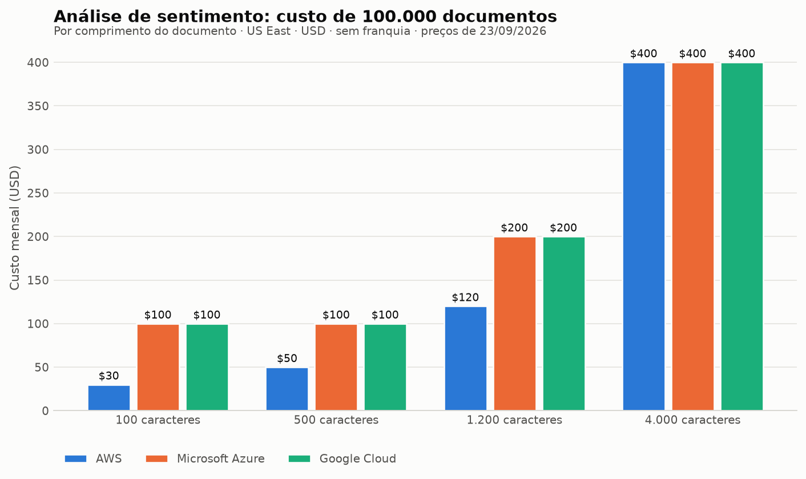

# Categoria 1 — NLP / análise de texto: análise de sentimento

**Operação comparada:** sentimento em nível de documento, sobre o mesmo texto em português (`O atendimento foi excelente.`)
**Modo de chamada:** síncrono, um documento por chamada
**Data da consulta às fontes:** 23/09/2026
**Região de referência:** US East (`us-east-1` / `East US` / global no caso do Google)


## 1. Objetivo da categoria e caso de uso

Análise de sentimento classifica a opinião predominante expressa em um texto. O caso de uso típico é processar avaliações de clientes, comentários de suporte ou menções em redes sociais para priorizar atendimento ou medir satisfação, sem que a equipe precise treinar um modelo próprio.

Todos os três provedores oferecem essa funcionalidade em modelos **pré-treinados**, acessíveis por chamada de API: o desenvolvedor envia texto e recebe uma avaliação de sentimento, sem etapa de treinamento, rotulagem ou hospedagem de modelo.

## 2. Serviços comparados e operação equivalente

| Provedor | Serviço | Operação síncrona de documento único |
|---|---|---|
| AWS | Amazon Comprehend | `DetectSentiment` |
| Microsoft Azure | Azure Language in Foundry Tools (antes Azure AI Language / Text Analytics) | Análise de sentimento via REST API ou client library |
| Google Cloud | Cloud Natural Language API (v1) | `analyzeSentiment` |

Cada provedor também oferece modos adicionais, que **não** entram na comparação por não serem equivalentes em carga: `BatchDetectSentiment` (até 25 documentos) e `StartSentimentDetectionJob` (assíncrono) na AWS; requisições assíncronas em lote na Azure; processamento de textos longos no Google.

## 3. Comparação técnica

### 3.1 Funcionalidades, entradas e saídas

| Aspecto | Amazon Comprehend | Azure Language | Cloud Natural Language |
|---|---|---|---|
| **Formato da saída** | Uma classe entre `POSITIVE`, `NEGATIVE`, `NEUTRAL` e `MIXED`, mais `SentimentScore` com um score para cada uma das quatro classes | Rótulo `positive`, `neutral` ou `negative`, com scores de confiança de 0 a 1 para as três classes | **Não retorna classe.** Devolve `score` (de −1,0 a +1,0) e `magnitude` (intensidade acumulada, não normalizada) |
| **Granularidade** | Documento | **Documento e sentença** (ambos na mesma resposta) | Documento e sentença |
| **Classe para texto ambíguo** | `MIXED` é uma classe própria, distinta de `NEUTRAL` | Não há classe `mixed` na saída de documento; o rótulo sai do maior score | Não há classe; cabe ao desenvolvedor definir limiares |
| **Codificação de entrada** | UTF-8 | Texto (string única por documento) | UTF-8 |
| **Tamanho máximo do documento** | **5 KB** por documento na operação síncrona de sentimento | **5.120 caracteres** por documento (síncrono), medidos por `StringInfo.LengthInTextElements` | **1.000.000 bytes** de conteúdo; até 100.000 tokens por requisição |
| **Documentos por requisição** | 1 (`DetectSentiment`); até 25 em `BatchDetectSentiment` | **10** documentos por requisição em análise de sentimento | 1 documento por requisição |
| **Tamanho máximo da requisição** | — | 1 MB | — |

O contraste mais importante para quem integra: **a AWS e a Azure entregam uma decisão pronta (uma classe), enquanto o Google entrega apenas um número contínuo.** Usar o Google exige que a aplicação defina os limiares que separam positivo, neutro e negativo — uma decisão de produto que os outros dois já tomam pelo desenvolvedor. Além disso, `magnitude` (Google) e `SentimentScore` (AWS) e confiança (Azure) são grandezas diferentes e não podem ser comparadas entre si.

### 3.2 Suporte a português

| Provedor | Códigos aceitos | Total de idiomas na operação |
|---|---|---|
| Amazon Comprehend | `pt` (Português, sem distinção de variante) | 12 idiomas, e o sentimento cobre todos eles |
| Azure Language | **`pt-BR` (Português do Brasil)** e `pt-PT` (Português de Portugal); `pt` também é aceito | **94 códigos de idioma** |
| Cloud Natural Language | `pt` (Português, sem distinção de variante) | 16 idiomas na análise de sentimento |

**Diferença relevante para aplicações brasileiras:** apenas a Azure distingue formalmente o português do Brasil do português de Portugal na análise de sentimento. AWS e Google tratam "português" como um único idioma. A documentação não afirma que essa distinção produza resultado melhor em textos brasileiros — isso seria uma conclusão experimental, fora do escopo desta etapa.

### 3.3 Formas de acesso, autenticação e configuração

| Aspecto | Amazon Comprehend | Azure Language | Cloud Natural Language |
|---|---|---|---|
| **Acesso** | API REST, AWS SDKs (Python/boto3, Java, .NET, Node.js, Ruby...), AWS CLI | REST API, client libraries (C#, Java, JavaScript, Python), **contêiner Docker para execução local** | REST (`POST .../v1/documents:analyzeSentiment`), gRPC, client libraries |
| **Autenticação** | Credenciais IAM (chave de acesso/segredo ou role), resolvidas pela cadeia padrão do SDK | **Chave do recurso + endpoint** próprios do recurso criado, ou Microsoft Entra ID | Conta de serviço com Application Default Credentials (`GOOGLE_APPLICATION_CREDENTIALS`) ou chave de API |
| **Endpoint** | Regional (`comprehend.us-east-1.amazonaws.com`) | Endpoint próprio do recurso, vinculado à região escolhida na criação | `language.googleapis.com` (global) |
| **Configuração mínima** | Região + credenciais | Criar um recurso *Azure Language in Foundry Tools*, obter chave e endpoint | Projeto com a API habilitada + credenciais |

A Azure é a única das três que oferece **execução em contêiner local** da análise de sentimento, o que importa em cenários com restrição de saída de dados. Em contrapartida, é a única que exige criar previamente um recurso e administrar um par chave/endpoint específico dele.

### 3.4 Limites operacionais e de taxa

| Aspecto | Amazon Comprehend | Azure Language | Cloud Natural Language |
|---|---|---|---|
| **Limite de requisições** | *Throttling* dinâmico: a AWS ajusta a vazão conforme a banda de processamento disponível, sem número fixo publicado para o modo síncrono | Depende do tier: **S/Multi-service 1.000 req/s**; **S0/F0 100 req/s e 300 req/min** | **600 requisições/minuto** e **800.000 requisições/dia** |
| **Regiões** | 13 regiões, incluindo US East (N. Virginia) e US East (Ohio); **não há região no Brasil** na lista publicada | Endpoint regional; East US disponível | API global |
| **Previsibilidade de vazão** | Baixa: não há cota publicada para planejar | Alta: cota explícita por tier | Alta: cota explícita |

O *throttling* dinâmico da AWS é uma diferença prática relevante: não é possível dimensionar a aplicação a partir de um número publicado, e a própria documentação recomenda implementar limitação de taxa no cliente e ativar alertas de cobrança.

### 3.5 Situação do serviço (avisos oficiais)

| Provedor | Aviso na documentação oficial |
|---|---|
| AWS | Nenhum aviso de descontinuação encontrado. |
| **Azure** | **"Sentiment analysis and opinion mining retire from Azure Language on March 31, 2029"**, com recomendação de migrar cargas existentes e direcionar novos projetos ao Microsoft Foundry. |
| Google | Nenhum aviso de descontinuação na página do `analyzeSentiment`. A única descontinuação oficial da API é a da versão `v1beta1`, encerrada em **27/12/2019**, que não atinge a `v1` em uso. |

Este é um critério de decisão concreto: escolher a análise de sentimento da Azure hoje significa assumir uma migração antes de **31/03/2029**.

## 4. Exemplos de código

Os três exemplos executam a **mesma operação** sobre o **mesmo texto**, e estão em:

- `exemplos/nlp/aws_comprehend.py`
- `exemplos/nlp/azure_language.py`
- `exemplos/nlp/google_natural_language.py`

**Estado de validação:** os três exemplos são **ilustrativos e não foram executados pelo grupo**. Foram adaptados da documentação oficial de cada provedor, conforme permitido pela seção 3 do enunciado ("Nesta etapa, os exemplos não precisam ter sido desenvolvidos ou executados pelo grupo"). Cada arquivo declara sua dependência, a fonte da adaptação e o mecanismo de autenticação. Nenhuma credencial está embutida no código: todos leem variáveis de ambiente.

## 5. Modelo de cobrança

| Provedor | Unidade de cobrança | Regra de contagem | Preço na primeira faixa |
|---|---|---|---|
| Amazon Comprehend | Unidade de **100 caracteres** | `ceil(caracteres/100)`, com **mínimo de 3 unidades (300 caracteres) por requisição** | $0,0001 por unidade (até 10M de unidades/mês) |
| Azure Language | Registro de texto de **1.000 caracteres** | `ceil(caracteres/1000)` por documento | $1,00 por 1.000 registros (até 0,5M de registros/mês) |
| Cloud Natural Language | Unidade de **1.000 caracteres Unicode** | `ceil(caracteres/1000)`, com mínimo de 1 unidade por requisição | $1,00 por 1.000 unidades (de 5 mil a 1M de unidades/mês) |

Todos os preços acima são de **US East, em USD, consultados em 23/09/2026**, e estão em `custos/premissas.csv` com a URL da fonte. Os da AWS vêm da *AWS Price List API* e os da Azure da *Azure Retail Prices API* — ambas APIs públicas oficiais dos próprios provedores, usadas porque as páginas comerciais de preço entregam as tabelas por JavaScript.

A regra de contagem do Google foi confirmada pelo exemplo da própria página de preços: 800, 1.500 e 600 caracteres são cobrados como 1 + 2 + 1 = **4 unidades**, ou seja, arredondamento para cima com mínimo de uma unidade.

A diferença de unidade é o fator que mais afeta o custo comparado: **um texto curto de 100 caracteres consome 1 unidade na AWS (sujeita ao mínimo da requisição) e 1 unidade inteira de 1.000 caracteres na Azure e no Google.** O efeito disso sobre o custo real é calculado na Fase 4, com cenários de comprimento variável, e é exatamente por isso que o cenário usa textos de 100, 500, 1.200 e 4.000 caracteres.

## 6. Cenário de custo, fórmulas, premissas e resultados

### Carga do cenário

**100.000 documentos por mês**, submetidos um por chamada síncrona, em quatro comprimentos: **100, 500, 1.200 e 4.000 caracteres**. A quantidade é hipotética e declarada como tal; o que importa é que **é idêntica nos três provedores**, como exige a seção 4 do enunciado. Os quatro comprimentos existem justamente para expor o efeito do tamanho da unidade de cobrança.

Todos os comprimentos cabem nos limites de entrada dos três serviços (o menor limite relevante é o de 5 KB do Comprehend).

### Fórmulas

```
AWS:     unidades = max(3, ceil(caracteres/100)) x 100.000 documentos
Azure:   registros = ceil(caracteres/1000) x 100.000 documentos
Google:  unidades = max(1, ceil(caracteres/1000)) x 100.000 documentos
```

O custo é progressivo por faixa: cada parcela do volume é cobrada ao preço da faixa em que cai — nunca o volume inteiro ao preço da última faixa.

### Resultados (USD/mês, sem franquia)

| Comprimento | Unidades cobradas AWS | AWS | Azure | Google |
|---|---|---|---|---|
| 100 caracteres | 300.000 (mínimo de 3/doc) | **$30,00** | $100,00 | $100,00 |
| 500 caracteres | 500.000 | **$50,00** | $100,00 | $100,00 |
| 1.200 caracteres | 1.200.000 | **$120,00** | $200,00 | $200,00 |
| 4.000 caracteres | 4.000.000 | $400,00 | $400,00 | $400,00 |



### O que os números mostram

O cenário revela um efeito que a tabela de preços isolada esconde: **para textos curtos, a granularidade da unidade importa mais que o preço unitário**. Um comentário de 100 caracteres consome 3 unidades de 100 caracteres na AWS, mas **uma unidade inteira de 1.000 caracteres** na Azure e no Google — pagando-se, nos dois casos, por 900 caracteres não enviados. O resultado é que a AWS custa **um terço** dos concorrentes nesse comprimento.

A vantagem encolhe conforme o texto cresce e **desaparece em 4.000 caracteres**, onde os três convergem para $400,00. A partir daí, o que separa os provedores não é mais a granularidade, e sim as faixas de volume.

Isso tem consequência prática direta: **a escolha mais econômica depende do comprimento típico do texto da aplicação.** Para avaliações curtas de produto ou mensagens de chat, a diferença é de 3 para 1; para documentos longos, é irrelevante.

### Franquias

As três franquias existem, mas **não são a mesma coisa** e por isso não entram na comparação principal:

| Provedor | Franquia | Natureza |
|---|---|---|
| AWS | 50.000 unidades/mês por API | **Promocional**: vale 12 meses a partir da primeira requisição |
| Azure | 5.000 registros/mês | **Tier F0 separado**, compartilhado entre várias features do Azure Language; não é desconto no tier S |
| Google | 5.000 unidades/mês | **Faixa da própria tabela** cobrada a $0,00; permanente |

Aplicadas ao cenário de 100 caracteres, reduzem o custo para $25,00 (AWS), $95,00 (Azure) e $95,00 (Google) — valores na coluna `custo_usd_com_franquia` de `custos/resultados.csv`. Como só a do Google é permanente e as três têm regras distintas, **a comparação principal usa os preços sem franquia**, que é a situação de regime.

### Reprodutibilidade

```
uv run custos/calcular_custos.py      # gera custos/resultados.csv (só stdlib)
uv run custos/verificar_calculos.py   # confere as contas à mão contra o programa
uv run custos/gerar_graficos.py       # gera os gráficos a partir do CSV
```

## 7. Síntese: vantagens, restrições e adequação por cenário

### As três diferenças que mais pesam

**1. O Google não entrega uma decisão, entrega um número.** AWS e Azure devolvem uma classe pronta (`POSITIVE`/`positive`); o Google devolve `score` e `magnitude` e deixa para a aplicação definir onde ficam as fronteiras entre positivo, neutro e negativo. Isso não é detalhe de formato: é trabalho de produto transferido para quem integra, e uma decisão que precisa ser justificada e congelada antes de qualquer avaliação. Em compensação, dá controle a quem quer calibrar o limiar ao próprio domínio.

**2. Só a AWS trata texto ambíguo como categoria.** A classe `MIXED` existe apenas no Comprehend. Na Azure, o rótulo sai do maior score entre três classes; no Google, não há classe alguma. Para uma aplicação que precisa separar "opinião dividida" de "sem opinião", só um dos três oferece isso pronto.

**3. Só a Azure distingue português do Brasil.** `pt-BR` e `pt-PT` são códigos separados na Azure, contra um `pt` genérico na AWS e no Google. Para um produto brasileiro isso é atraente — mas **a documentação não promete resultado melhor**, e afirmar que produz seria extrapolar. É exatamente o tipo de hipótese que a Etapa 2 pode testar.

### Custo: a granularidade da unidade domina em textos curtos

O cenário de 100.000 documentos mostrou que **a AWS custa um terço dos concorrentes em textos de 100 caracteres** ($30,00 contra $100,00), porque cobra em unidades de 100 caracteres enquanto Azure e Google cobram uma unidade inteira de 1.000. A vantagem some em 4.000 caracteres, onde os três convergem para $400,00.

Ou seja: **não existe "o mais barato" nesta categoria — existe o mais barato para o seu comprimento de texto.**

### O risco que nenhuma tabela de preço mostra

A análise de sentimento da Azure tem **encerramento anunciado para 31/03/2029**, com migração recomendada para o Microsoft Foundry. Nenhum concorrente comparado tem aviso equivalente. Para um sistema que se espera manter por anos, isso é um custo futuro de migração que não aparece em nenhum cenário de preço.

### Adequação por cenário

| Situação | Alternativa mais adequada | Por quê |
|---|---|---|
| Alto volume de **textos curtos** (avaliações, chat, comentários) | **Amazon Comprehend** | Unidade de 100 caracteres torna o custo até 3× menor; `MIXED` ajuda em opinião dividida |
| Necessidade de **sentimento por sentença** junto com o do documento | **Azure Language** | Entrega os dois níveis na mesma resposta |
| Restrição de **saída de dados** do ambiente próprio | **Azure Language** | Único dos três com contêiner Docker para execução local |
| Aplicação que quer **calibrar o limiar** ao próprio domínio | **Cloud Natural Language** | O score contínuo é matéria-prima, não uma decisão já tomada |
| Sistema com **horizonte longo de manutenção** | AWS ou Google | A oferta da Azure tem encerramento datado |
| **Documentos longos** (acima de ~4.000 caracteres) | Indiferente no custo | Os três convergem; decidir por critério técnico |

**O que esta etapa não responde:** qual dos três classifica melhor sentimento em português. Isso exige execução, gabarito e medição — é o objeto da Etapa 2.

## 8. Referências e pendências de verificação

### Fontes usadas neste capítulo

Detalhamento completo em `referencias/fontes.md`.

| ID | O que sustenta |
|---|---|
| NLP-AWS-01 | Operações de sentimento, classes retornadas e estrutura de `SentimentScore` |
| NLP-AWS-02 | Limites de tamanho por operação (5 KB síncrono, 25 documentos em lote) e regiões suportadas |
| NLP-AWS-03 | Idiomas suportados: sentimento cobre todos os 12 idiomas, incluindo `pt` |
| NLP-AZ-01 | Nome atual do serviço, aviso de encerramento em 31/03/2029, rótulos e granularidade, formas de acesso |
| NLP-AZ-02 | Limites de dados: 5.120 caracteres por documento, 10 documentos por requisição, 1 MB por requisição, limites de taxa por tier, definição de registro de texto como 1.000 caracteres |
| NLP-AZ-03 | Suporte a 94 idiomas, com `pt-BR` e `pt-PT` distintos |
| NLP-GC-01 | Operação `analyzeSentiment` e ausência de aviso de descontinuação |
| NLP-GC-02 | Descontinuação restrita à `v1beta1` (27/12/2019) |
| NLP-GC-03 | Cotas: 1.000.000 bytes de conteúdo, 100.000 tokens, 600 req/min, 800.000 req/dia |
| NLP-GC-04 | Idiomas com suporte a análise de sentimento, incluindo `pt` |

### Pendências

- **Preços não verificados** até esta data. As unidades de cobrança na seção 5 estão marcadas como "a confirmar" para AWS e Google; apenas a definição de registro de texto da Azure vem de fonte já consultada. Nenhum cálculo de custo é apresentado antes dessa verificação.
- A documentação da AWS **não publica cota fixa de requisições por segundo** para o modo síncrono; a comparação de vazão fica limitada a esse fato, sem número.
- O comportamento do `MIXED` da AWS e a ausência de classe equivalente nos outros dois é uma diferença **documental**. Qual serviço classifica melhor textos ambíguos em português é pergunta experimental, e só pode ser respondida na Etapa 2.
