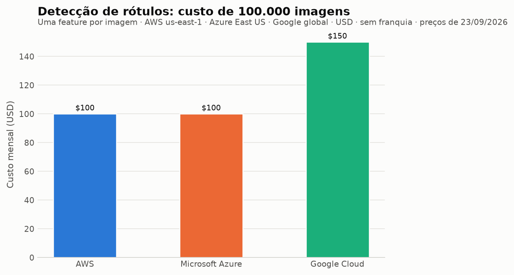

# Categoria 2 — Visão computacional: detecção de rótulos em imagem

**Operação comparada:** detecção de rótulos (labels/tags) do conteúdo da mesma imagem, sem localização
**Modo de chamada:** síncrono, uma imagem por chamada
**Data da consulta às fontes:** 23/09/2026
**Região de referência:** US East (`us-east-1` / `East US` / global no caso do Google)


## 1. Objetivo da categoria e caso de uso

Detecção de rótulos responde à pergunta "o que aparece nesta imagem?", devolvendo termos como *pessoa*, *carro* ou *praia* com um grau de confiança. O caso de uso típico é indexar e tornar pesquisável um acervo de imagens enviadas por usuários, alimentar filtros de catálogo ou fazer uma triagem inicial de conteúdo antes de revisão humana.

Escolheu-se a detecção de rótulos — e não detecção de objetos com caixas delimitadoras — porque é a operação com equivalente direto nos três provedores e a que produz saída mais comparável.

## 2. Serviços comparados e operação equivalente

| Provedor | Serviço | Operação comparada |
|---|---|---|
| AWS | Amazon Rekognition | `DetectLabels`, feature `GENERAL_LABELS` |
| Microsoft Azure | Azure Vision in Foundry Tools — Image Analysis | *Tag visual features* (Tags), via Analyze Image |
| Google Cloud | Cloud Vision API | Feature `LABEL_DETECTION`, via `images:annotate` |

## 3. Comparação técnica

### 3.1 Entradas: formatos e limites

| Aspecto | Amazon Rekognition | Azure Image Analysis | Cloud Vision API |
|---|---|---|---|
| **Formatos aceitos** | **Apenas PNG e JPEG** | v4.0: JPEG, PNG, GIF, BMP, WEBP, ICO, TIFF, MPO · v3.2: JPEG, PNG, GIF, BMP | Em `images:annotate` (o endpoint comparado): JPEG, PNG8, PNG24, GIF, GIF animado (só o primeiro quadro), BMP, WEBP, RAW, ICO. **PDF e TIFF existem, mas por outro endpoint** — ver nota abaixo |
| **Tamanho máximo** | **15 MB** como objeto no Amazon S3; **5 MB** quando enviada como bytes na requisição | v4.0: **menos de 20 MB** · v3.2: **menos de 4 MB** | **20 MB** por imagem; requisição JSON limitada a **10 MB** |
| **Dimensões** | Mínimo 80×80 px; máximo **10.000 px** de largura e altura para `DetectLabels` | Entre **50×50** e **16.000×16.000** px | Resolução recomendada de **640×480 px** para `LABEL_DETECTION` |
| **Origem da imagem** | Objeto no Amazon S3 ou bytes na requisição | Bytes na requisição ou URL da imagem | Arquivo local em base64, URI do Cloud Storage (`gs://`) ou URL remota |

O Cloud Vision aceita a maior variedade de formatos e o Rekognition a menor (só PNG e JPEG). Para um pipeline que recebe upload livre de usuários, isso significa que **a AWS exige uma etapa de conversão** que os outros dois dispensam em vários casos.

**PDF e TIFF no Cloud Vision são outro caminho, não o mesmo.** A lista oficial de formatos suportados inclui PDF e TIFF, mas eles **não** são aceitos pelo `images:annotate` usado nesta comparação: exigem o endpoint **`files:annotate`**, que trata o arquivo como documento de várias páginas. O `LABEL_DETECTION` está entre as features suportadas nesse endpoint, de modo que a capacidade existe — porém com fluxo, limites e condições próprios (entre eles, chaves de API não são aceitas em `files:annotate`). Misturar as duas coisas na mesma linha da tabela superestimaria a compatibilidade do endpoint comparado, e por isso os dois caminhos ficam separados aqui.

### 3.2 Saídas

| Aspecto | Amazon Rekognition | Azure Image Analysis | Cloud Vision API |
|---|---|---|---|
| **Campos por rótulo** | `Name`, `Confidence`, `Parents` (hierarquia), `Aliases` (sinônimos), `Categories`, `Instances` (com `BoundingBox` quando aplicável) | Tags com nome e confiança | `mid` (identificador no Google Knowledge Graph), `description`, `score`, `topicality` |
| **Escala da confiança** | **0 a 100** | 0 a 1 | **0 a 1** |
| **Estrutura semântica** | Hierarquia explícita: um rótulo traz seus rótulos-pai, apelidos e categoria | Lista plana de tags | `mid` permite ligar o rótulo a uma entidade do Knowledge Graph |
| **Controle de quantidade** | `MaxLabels` e `MinConfidence` | Parâmetros da chamada Analyze | `maxResults` (**padrão 10** se omitido) |
| **Filtros** | `LabelInclusionFilters`, `LabelExclusionFilters`, `LabelCategoryInclusionFilters`, `LabelCategoryExclusionFilters` | — | — |
| **Versão do modelo na resposta** | `LabelModelVersion` | — | — |

Três diferenças importam na integração:

1. **A escala de confiança não é a mesma.** A AWS usa 0–100 e os outros dois 0–1. Qualquer comparação ou limiar compartilhado exige normalização explícita.
2. **A AWS é a única que devolve taxonomia.** `Parents`, `Aliases` e `Categories` permitem agrupar rótulos sem manter um dicionário próprio, e os filtros de inclusão/exclusão permitem restringir a resposta no servidor. Nos outros dois isso fica por conta da aplicação.
3. **O Google é o único que devolve identificador estável** (`mid`) ligado ao Knowledge Graph, útil para associar rótulos a uma base de conhecimento em vez de comparar strings.

Os vocabulários de rótulos **não são compatíveis entre provedores**: nomes, granularidade e idioma dos termos diferem, e não há tabela oficial de equivalência. Comparar "quantos rótulos cada um acertou" exigiria um gabarito próprio — trabalho de avaliação prática, não desta etapa.

### 3.3 Formas de acesso, autenticação e configuração

| Aspecto | Amazon Rekognition | Azure Image Analysis | Cloud Vision API |
|---|---|---|---|
| **Acesso** | API REST, AWS SDKs (Python, Java, .NET, Node.js, Ruby), AWS CLI | REST API (`aka.ms/vision-4-0-ref`) e client library SDK | REST (`POST https://vision.googleapis.com/v1/images:annotate`), gRPC, client libraries, `gcloud ml vision detect-labels` |
| **Autenticação** | Credenciais IAM; para ler imagem do S3, também permissão de leitura no bucket | Chave + endpoint do recurso *Azure Vision in Foundry Tools* | Application Default Credentials ou chave de API |
| **Configuração mínima** | Região + credenciais (+ bucket S3, se usar essa origem) | Criar o recurso **em região suportada** (East US está na lista) | Projeto com a API habilitada |

A Azure é a única das três com **restrição de região documentada para a própria funcionalidade**: a página oficial lista as regiões em que o Image Analysis existe, e recursos criados fora delas não atendem à operação. AWS e Google não impõem essa barreira para a operação comparada.

### 3.4 Limites operacionais e de taxa

| Aspecto | Amazon Rekognition | Azure Image Analysis | Cloud Vision API |
|---|---|---|---|
| **Limite de requisições** | TPS por operação e por região, ajustável via AWS Service Quotas; erros `ProvisionedThroughputExceededException` e `ThrottlingException` são documentados como reentráveis | Conforme o tier do recurso | Cotas por projeto |
| **Recomendação oficial** | Suavizar picos de tráfego (fila), configurar *retries* com *backoff* exponencial e *jitter* | — | — |
| **Processamento em massa** | Image Bulk Analysis: lotes de até 10.000 imagens, manifesto de até 50 MB | — | — |

### 3.5 Situação do serviço (avisos oficiais)

| Provedor | Aviso na documentação oficial |
|---|---|
| AWS | Nenhum aviso de descontinuação para `DetectLabels`. |
| **Azure** | **"The Image Analysis 4.0 service in Azure Vision in Foundry Tools is deprecated and will be retired on September 25, 2028"**, com guia de migração indicado. Funcionalidades da versão 4.0 em preview já foram encerradas antes: Custom Image Classification, Custom Object Detection, Product Recognition e a API Segment / remoção de fundo foram desativadas em **31/03/2025**. |
| Google | Nenhum aviso de descontinuação para `LABEL_DETECTION`. |

Esse é o segundo serviço da Azure comparado neste trabalho com encerramento anunciado — o primeiro foi a análise de sentimento (31/03/2029). O histórico de funcionalidades já retiradas em 2025 reforça que a cadência de mudança da oferta de visão da Azure é mais alta que a dos concorrentes, o que é um fator de risco de manutenção para quem integra hoje.

## 4. Exemplos de código

Os três exemplos executam a **mesma operação** sobre a **mesma imagem**:

- `exemplos/visao/aws_rekognition.py`
- `exemplos/visao/azure_image_analysis.py`
- `exemplos/visao/google_vision.py`

**Estado de validação:** exemplos **ilustrativos, não executados pelo grupo**, adaptados da documentação oficial de cada provedor, conforme a seção 3 do enunciado. Nenhuma credencial está embutida: todos leem variáveis de ambiente.

## 5. Modelo de cobrança

| Provedor | Unidade de cobrança | Preço na primeira faixa |
|---|---|---|
| Amazon Rekognition | Por **imagem processada** (APIs do Grupo 2, onde está o `DetectLabels`) | $0,0010 por imagem (até 1M de imagens/mês) |
| Azure Image Analysis | Por **transação**, cobrada a cada 1.000 (feature *Tag* pertence ao **Grupo 1**) | $1,00 por 1.000 transações (até 1M/mês) |
| Cloud Vision API | Por **unidade**, onde cada feature aplicada a uma imagem conta como uma unidade | $1,50 por 1.000 unidades (de 1.000 a 5M/mês) |

Preços de **US East, em USD, consultados em 23/09/2026**, registrados em `custos/premissas.csv`. Os da AWS vêm da *AWS Price List API* e os da Azure da *Azure Retail Prices API*.

A regra do Cloud Vision confirma-se na página oficial: aplicar duas features à mesma imagem gera duas unidades cobradas. Como o cenário usa **uma única feature por imagem** (`LABEL_DETECTION`), a carga permanece equivalente entre os três. O enquadramento da feature *Tag* no Grupo 1 da Azure — e não no Grupo 2, mais caro na primeira faixa — também foi confirmado na página de preços, que lista `Tag` entre as features do Grupo 1.

## 6. Cenário de custo, fórmulas, premissas e resultados

### Carga do cenário

**100.000 imagens por mês**, uma chamada por imagem, com **uma única feature de detecção de rótulos** em cada. A quantidade é hipotética e declarada como tal, e é idêntica nos três provedores.

Restringir a uma feature por imagem não é detalhe: é o que mantém a carga comparável, já que o Cloud Vision cobra por feature aplicada e não por imagem.

### Fórmulas

```
AWS:     100.000 imagens (1 unidade por imagem)
Azure:   100.000 transações (1 imagem com 1 feature = 1 transação)
Google:  100.000 unidades (1 feature x 1 imagem = 1 unidade)
```

### Resultados (USD/mês)

| Provedor | Unidades cobradas | Sem franquia | Com a franquia aplicável |
|---|---|---|---|
| AWS — Rekognition | 100.000 imagens | **$100,00** | $99,00 (só nos 12 primeiros meses) |
| Azure — Image Analysis (Grupo 1) | 100.000 transações | **$100,00** | **$100,00** (o F0 não abate o tier pago) |
| Google — Cloud Vision | 100.000 unidades | $150,00 | $148,50 (faixa permanente da tabela) |



### O que os números mostram

Nesta categoria a comparação é mais simples que em NLP, porque **a unidade de cobrança é praticamente a mesma nos três** — uma imagem analisada. Não há efeito de granularidade a explorar: o que se compara é o preço direto.

AWS e Azure ficam empatados em $100,00 no volume do cenário, e o Google fica **50% acima**, em $150,00. Vale registrar que essa ordem não é estável em qualquer volume: as faixas têm degraus diferentes (a Azure desce para $0,65/mil a partir de 1M de transações, a AWS para $0,0008/imagem a partir de 1M de imagens, e o Google só desce para $1,00/mil depois de 5M de unidades), de modo que um volume muito maior muda as distâncias relativas.

### Franquias

| Provedor | Franquia | Natureza | Aplicável a este cenário? |
|---|---|---|---|
| AWS | 1.000 imagens/mês | Promocional, 12 meses a partir da criação da conta | **Sim, só nos 12 primeiros meses** |
| Azure | 5.000 transações/mês (limite de 20/minuto) | Tier F0 separado | **Não** — recurso à parte, não desconto no tier pago. O que de fato impede o F0 de sustentar o cenário é a **cota mensal de 5.000 transações** (5% das 100.000 necessárias); o limite de 20/minuto, isoladamente, processaria as 100.000 imagens em cerca de 83 horas, o que caberia num mês — não é ele o fator restritivo |
| Google | 1.000 unidades/mês | Primeira faixa da tabela, permanente | **Sim** |

Como a faixa de 0,00 USD do Google é permanente, **a cobrança habitual dele é $148,50, não $150,00**; o valor sem franquia é uma simulação para manter a comparação simétrica com AWS e Azure.

**Regra adotada em todo o trabalho.** A coluna `custo_usd_com_franquia` de `custos/resultados.csv` desconta **somente** as franquias que incidem sobre a operação comparada; a coluna `franquia_aplicada` registra a decisão linha por linha e `custos/franquias.csv` guarda a justificativa de cada caso. Abater o tier F0 da Azure de uma fatura do tier pago somaria duas coisas que a Microsoft cobra separadamente: o F0 é um **recurso à parte**, com cota e limites próprios, e não um desconto no recurso pago. Usá-lo exigiria dividir a carga entre dois recursos — uma hipótese de arquitetura que teria de ser definida e justificada, e que este cenário não adota.

### Reprodutibilidade

```
uv run custos/calcular_custos.py      # gera custos/resultados.csv (só stdlib)
uv run custos/verificar_calculos.py   # confere as contas à mão contra o programa
uv run custos/gerar_graficos.py       # gera os gráficos a partir do CSV
```

## 7. Síntese: vantagens, restrições e adequação por cenário

### O que separa as três ofertas

**A AWS é a única que entrega taxonomia junto com o rótulo.** `Parents`, `Aliases` e `Categories` permitem agrupar e filtrar rótulos sem manter um dicionário próprio, e os filtros de inclusão/exclusão rodam no servidor. Nos outros dois, essa camada fica por conta da aplicação.

**O Google é o mais permissivo na entrada e o único com identificador estável.** No endpoint comparado aceita RAW, WEBP, GIF, BMP e ICO além de PNG e JPEG — contra **apenas PNG e JPEG na AWS** —, o que elimina uma etapa de conversão em pipelines que recebem upload livre; PDF e TIFF também são suportados, mas pelo endpoint `files:annotate`, com fluxo próprio. E o campo `mid` liga cada rótulo a uma entidade do Knowledge Graph, em vez de obrigar comparação por string.

**A Azure é a que exige mais atenção à região e ao calendário.** É a única com lista fechada de regiões para a própria funcionalidade, e a única com **encerramento anunciado: o Image Analysis 4.0 sai de operação em 25/09/2028**. O histórico reforça o ponto: quatro funcionalidades em preview já foram desativadas em 31/03/2025.

Um detalhe que atravessa a integração dos três: **a escala de confiança não é a mesma** (0–100 na AWS, 0–1 nos outros dois), e os vocabulários de rótulos não têm equivalência oficial. Trocar de provedor aqui não é trocar de endpoint — é recalibrar limiares e remapear termos.

### Custo: a categoria mais previsível das três

Como a unidade de cobrança é essencialmente a mesma nos três — uma imagem analisada — não há efeito de granularidade a explorar. No cenário de 100.000 imagens, **AWS e Azure empatam em $100,00 e o Google fica 50% acima, em $150,00**.

Essa ordem não vale para qualquer volume: os degraus de faixa são diferentes, e o Google só reduz o preço depois de 5 milhões de unidades, enquanto AWS e Azure já reduzem a partir de 1 milhão.

### Adequação por cenário

| Situação | Alternativa mais adequada | Por quê |
|---|---|---|
| Pipeline com **formatos heterogêneos** de upload | **Cloud Vision** | Aceita RAW, WEBP, GIF, BMP e ICO no mesmo endpoint, e PDF/TIFF por `files:annotate`; a AWS exigiria conversão para PNG/JPEG |
| Necessidade de **agrupar rótulos por categoria ou hierarquia** | **Amazon Rekognition** | Único que devolve `Parents`, `Aliases` e `Categories` |
| Integração com **base de conhecimento** | **Cloud Vision** | O `mid` dá identificador estável em vez de string |
| Sensibilidade a **custo** no volume analisado | **AWS ou Azure** | $100,00 contra $150,00 do Google em 100 mil imagens |
| **Volume muito alto** (acima de 1 milhão/mês) | Recalcular | Os degraus de faixa diferem e mudam a ordem |
| Sistema com **horizonte longo de manutenção** | AWS ou Google | O Image Analysis 4.0 da Azure encerra em 25/09/2028 |

**O que esta etapa não responde:** qual serviço produz rótulos mais corretos ou mais úteis. Sem gabarito e sem execução, isso não é afirmável.

## 8. Referências e pendências de verificação

### Fontes usadas neste capítulo

| ID | O que sustenta |
|---|---|
| VIS-AWS-01 | Operação `DetectLabels`, parâmetros, filtros e estrutura da resposta |
| VIS-AWS-02 | Limites: 15 MB no S3, 5 MB em bytes, PNG e JPEG, dimensões mínima e máxima, orientações de TPS e tratamento de throttling |
| VIS-AZ-01 | Nome atual do serviço, aviso de encerramento em 25/09/2028, funcionalidades retiradas em 31/03/2025, requisitos de entrada v4.0 e v3.2, disponibilidade regional |
| VIS-GC-01 | Feature `LABEL_DETECTION`, endpoint, campos da resposta e `maxResults` padrão |
| VIS-GC-02 | Formatos suportados, limite de 20 MB por imagem e 10 MB por requisição JSON, resolução recomendada |
| VIS-GC-03 | PDF e TIFF são processados por `files:annotate`, não por `images:annotate`; `LABEL_DETECTION` está entre as features aceitas nesse endpoint |

### Pendências

- **Preços: verificados.** As faixas usadas estão em `custos/premissas.csv` com status `verificado_oficial`, URL, região e data (23/09/2026). O enquadramento da feature *Tag* no Grupo 1 da Azure foi confirmado na página de preços.
- O valor padrão de `MinConfidence` do `DetectLabels` **não foi localizado** nas páginas consultadas; o exemplo de código define o parâmetro explicitamente para não depender do padrão.
- A Azure não publica, nas páginas consultadas, limite de tamanho de resposta ou número máximo de tags por imagem.
- Qual serviço produz rótulos mais corretos é pergunta **experimental** e não é respondida nesta etapa.
